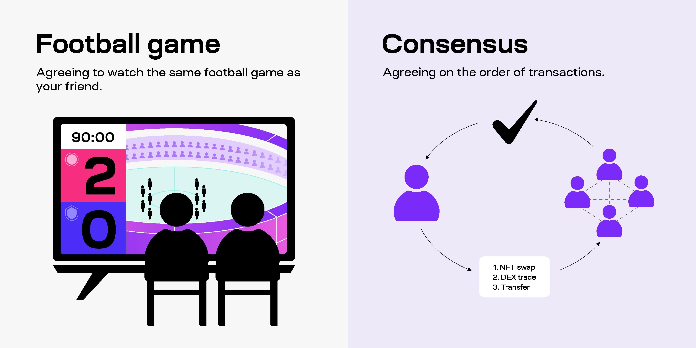
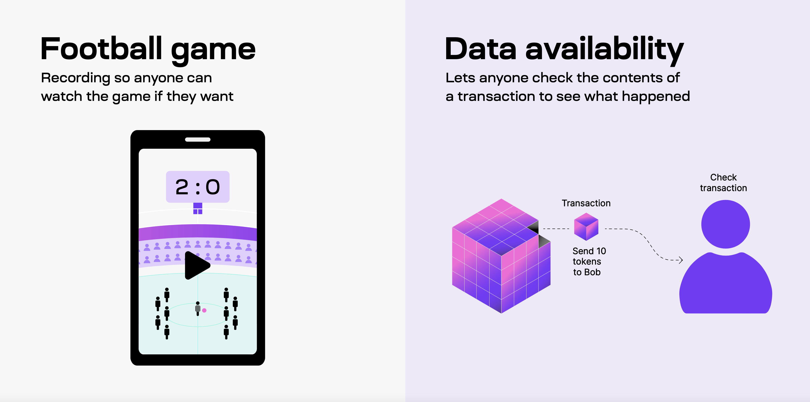

<head>
  <meta name="twitter:card" content="summary_large_image">
  <meta name="twitter:site" content="@CelestiaOrg">
  <meta name="twitter:creator" content="@likebeckett">
  <meta name="twitter:title" content="Benefits of Modular Blockchains">
  <meta name="twitter:description" content="Understanding the modular stack with football analogies.">
  <meta name="twitter:image" content="https://raw.githubusercontent.com/celestiaorg/celestia.org/main/src/pages/markdown-pages/learn/images/learn-modular-twitter-card.png">
</head>

#### Summary
- **Execution** is like playing a football game according to the rules and figuring out the final score.
- **Settlement** is similar to solving arguments during a football game.
- **Consensus** is like agreeing to watch the same football game as your friend.
- **Data availability** is similar to streaming and recording a football game.

#### Modular blockchains
Modular blockchains specialize in one or two tasks. You might’ve come across a similar image that tries to explain the concept of modular blockchain specialization.

But a lot of those words are probably unfamiliar to you. Execution, settlement, consensus, and data availability are all tasks that modular blockchains can specialize in.

But what are those tasks exactly? To answer that, we’ll need to visit the football pitch. And football here means soccer.

#### Execution
Imagine a football game between two teams from different countries. Of course, each country may have slightly different rules for how they play football. But on game day, the two teams play using the same set of rules, so that umpires know when to call fouls, offsides, and give teams points for scoring goals.

After the game finishes, the scores are recorded and published online. Fans can look at the scores to check who won if they don’t feel like spending 90 minutes watching the whole game.

The execution task that modular blockchains can specialize in is like playing a football game according to the rules and figuring out the final score.

After someone has gathered a bunch of transactions, the outcome is sent around the network and verified by users. Users can check the final outcome without looking through each transaction, just like fans can see the final score online without watching the entire game.

#### Settlement
Back to the game…

During the match, one of the teams scored a goal. Let’s call them team A. The other team (team B) wasn’t happy and argued that the goal didn’t count because the striker was offside. Of course, the game can’t continue until the argument is solved.

To figure out which team was correct, the umpires watched a replay of the striker scoring the goal. As it turns out, the striker for team A was offside. Now that the argument was solved and team B was right, the game could continue without any changes to the scores.

The settlement task in modular blockchains is similar to solving arguments during a football game. If someone thinks that a transaction is incorrect, the blockchain stops until the disagreement is solved. If a transaction turns out to be incorrect, it gets rejected, just like a goal that doesn’t count if the striker is offside.

#### Consensus
Now imagine you were watching the football game between team A and B at home. The game finished and your favorite team (team A) won. Straight to the phone, you messaged your friend to tell him about your winning team.

Your friend quickly replied back “yeah right, team B actually won!” The two of you spend 15 minutes arguing about the winner until it hits you. Both of you were watching two different games. No wonder you couldn’t agree about who won the game.

The consensus task in modular blockchains works in a similar way. Transactions get ordered first. If people see different orders of the transactions, they won’t be able to agree on the right order - just like you and your friend couldn’t agree on which team won.

When people see the same order of transactions they can agree the order is correct - just like your friend agreeing on which team won after you both realized what games you were watching.

#### Data availability
Now team A and B are playing again. This time, the game is happening in your town. Of course you go to buy tickets. But it turns out that ticket prices are five times higher than usual. You can’t afford tickets to the stadium, but you could still watch the game online.

It gets worse. The game isn’t going to be streamed. Only people that go to the stadium would get to watch the game. Pretty unfair isn’t it? But there’s a bigger problem. Anyone could lie to you about who won. Without a recording, there’s no way to prove the score is real. You just have to trust someone that actually got to watch the game at the stadium.

The data availability task in modular blockchains is similar to recording and streaming a football game. Data availability lets anyone check the contents of a transaction to see what happened, just like a recording lets people at home watch the game to find out the score, even if they can’t afford to go to the stadium.

#### Conclusion
And those are all the modular blockchain tasks as aspects of a football game. It might take a little bit to memorize exactly what each task is. But the big thing to remember is that each modular blockchain fulfills a specific task they’re really good at. And of course, modular blockchains collaborate with each other to make the whole system work.
